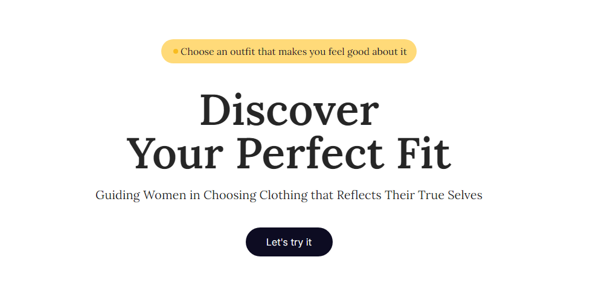

# Wardrobe-Fit🧥

Sebuah platform web aplikasi yang dirancang khusus untuk memenuhi kebutuhan pakaian wanita yang ingin tampil modis dan percaya diri saat menghadiri acara seperti hangout dan pesta ulang tahun.

Produk ini menawarkan berbagai fitur yang membantu pengguna dalam memilih pakaian yang sesuai dengan gaya mereka.

Dengan koleksi pakaian terkini, WardrobeFit memberikan pengalaman yang menyenangkan dan efisien untuk mencapai tampilan yang sempurna dalam setiap kesempatan.

## Contributors🔗

<table>
  <tbody>
    <tr>
      <td align="center" valign="top" width="14.28%"><a href="https://dimdimm-doc.vercel.app/"> <b>Dimah Luthfi</b></a> <a href="https://github.com/dimdimah" title="Code">💻</a> <a href="#design" title="Design">🎨</a> <a href="#ideas" title="Ideas, Planning, & Feedback">🤔</a> <a href="https://github.com/dimdimah/mini-project-alterra-bacth-5" title="Documentation">📖</a>
      </td>
  </tbody>
</table>

## References

<a href='https://www.figma.com/file/VtX1wG3N6uQnoqXLuf9Zz9/MiniProject-Alterra-5?type=design&node-id=0%3A1&mode=design&t=QDHdwBzZjyx0iAQ1-1'>Figma Mini Project Alterra Batch 5</a>

## Demo

<a href=''>Mini Project Alterra Batch 5</a>
